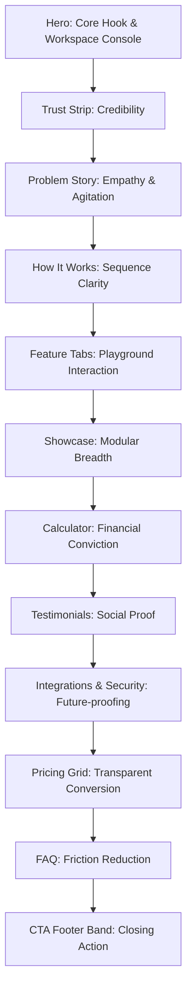

# Squeako Workspace: Premium SaaS Design Strategy

This document outlines the comprehensive visual, layout, and user experience strategy for redesigning the **Squeako** marketing platform. Designed for Indian startups and SMBs, Squeako requires a design that commands trust, highlights economic value, and matches the visual calibre of global tier-1 platforms like Vercel, Linear, Stripe, and Notion.

---

## 1. Overall Website Vision

### 1.1. Design Direction
The design direction adopts a **Neo-SaaS Premium dark mode** aesthetic. Instead of flat, generic layouts, it utilizes depth layering, glowing borders, precise grids, and high-fidelity mockups. The tone is highly professional, clean, and developer-grade, appealing to modern Indian founders and technical leaders.

### 1.2. Visual Personality
*   **Calm & Focused:** Clean workspaces, structured menus, and plenty of breathing room.
*   **Trustworthy & Compliant:** Localized elements (Mumbai data center badges, DPDP-ready labels) are displayed with high contrast.
*   **Energetic & Optimistic:** A vibrant primary color (representing Indian tech momentum) paired with dark, metallic backgrounds.

### 1.3. Premium Feel
We achieve a premium feel through:
*   **Glassmorphism:** Navigation menus and interactive controls hover on blur filters (`backdrop-blur-xl`).
*   **Fine Outlines:** Cards, sections, and containers use thin, subtle borders (`border-border/60`).
*   **Soft Ambient Glows:** Subtle radial gradients are placed behind interactive dashboards and hero text to draw focus.
*   **Micro-interactions:** Hover lifts, smooth tab transitions, and subtle parallax movements on scroll.

### 1.4. User Experience Philosophy
The interface operates under a **"Zero-Friction Discovery"** model. Users should understand Squeako's value proposition within 5 seconds of landing. Information is layered: critical value statements are immediate, while granular capability matrices are deferrable.

---

## 2. Layout Strategy

To maximize conversion, the home page follows a strategic layout flow:



### 2.1. Section Placement Rationale
1.  **Hero (Attract & Explain):** Hooks attention immediately with the value statement and a live interactive preview of the tool itself.
2.  **Trust Strip (Establish Authority):** Placed directly below the hero to validate the product immediately with brand logos before the user reads detailed copy.
3.  **Problem Story (Identify & Empathize):** Agitates the pain points of fragmented, foreign tools billed in USD before introducing the solution.
4.  **How It Works (Simplify Setup):** Lowers the barrier to entry by showing that migrating from Slack/Teams takes 3 simple steps.
5.  **Feature Tabs Playground (Engagement):** Allows users to play with the core product capabilities (Chat, Meet, Task, Presence, Org Chart) in an interactive UI.
6.  **Calculator (Confirm Savings):** Hard mathematical proof showing the direct financial impact of switching (up to 70% savings in INR).
7.  **Social Proof & Security (Settle Objections):** Case metrics followed immediately by data residency and compliance assurances.
8.  **Pricing & FAQ (Close Deal):** Clear, GST-compliant tier charts followed by FAQs to resolve remaining friction.
9.  **CTA & Footer (Final Nudge):** Clean closing banner to push users to the trial lead form.

---

## 3. Hero Strategy

The hero section must establish the core value statement, build immediate trust, and display product quality.

```
+-----------------------------------------------------------+
|               Annoucement Bar: GST & INR                  |
+-----------------------------------------------------------+
|                                                           |
|             Pill: 100% Indian Data Residency              |
|                                                           |
|                 CORE VALUE HEADLINE COPY                  |
|                                                           |
|              Supporting descriptive subcopy               |
|                                                           |
|             [Primary CTA]     [Secondary CTA]             |
|                                                           |
|                 Trust badges / setup metrics              |
|                                                           |
|            +---------------------------------+            |
|            |                                 |            |
|            |    Interactive Workspace        |            |
|            |    Console Preview              |            |
|            |                                 |            |
|            +---------------------------------+            |
+-----------------------------------------------------------+
```

### 3.1. Composition & Hierarchy
*   **Eyebrow Tag:** A top-centered pill highlighting *"100% Data Residency in India &middot; GST Billed in INR"* to address the compliance hook first.
*   **Headline (H1):** Sized dynamically at `clamp(2.2rem, 5vw, 3.6rem)` with strict line height (`1.08`). Employs a highlighted gradient span on pricing words (e.g., *"priced for growth"*).
*   **Subcopy:** Sized at `1.15rem` with a max-width of `680px`. Summarizes the 6-in-1 tool consolidation and cost savings.
*   **Twin Call-To-Action (CTA):** Centered below the subcopy. The primary button is high-contrast, while the secondary button uses a subtle outline.
*   **Trust Metrics Line:** Beneath the buttons, a line detailing *"Free 14-day trial &bull; No credit card required &bull; Saves up to ₹6,500/user/yr"* settles immediate objections.
*   **Visual Focus (Workspace Console):** A high-fidelity mockup of the Squeako desktop client (showing chats, tasks, and threads) is placed below the CTAs, offset by a subtle 3D perspective or flat border with an ambient background glow.
*   **Hero Height:** Targeted at `75vh` to `80vh` to keep text and CTA controls above the fold, with the console preview naturally leading the eye below the fold.

---

## 4. Navbar Strategy

The navbar acts as a structural anchor, providing clean pathways to deep-dive content.

*   **Style:** Transparent dark glassmorphism layout (`bg-black/60` or `bg-bg-base/70` with `backdrop-blur-xl`) bounded by a bottom hairline border (`border-b border-border/40`).
*   **Position & Sticky Behavior:** Sticky at the top of the viewport. On scroll, the navbar compacts vertically (padding reduces from `py-4` to `py-2.5`) to maximize reading screen real estate.
*   **CTA Placement:** Far-right placement of the main "Start free" button, ensuring it remains visible across all pages.
*   **Mega-Menu Architecture:**
    *   *Product Dropdown:* Divided into clear sub-categories (Communicate, Meet, Organize) with custom icons, plus a dedicated security compliance path on the right.
    *   *Solutions Dropdown:* Grouped clearly by "By Team" and "By Industry" to provide targeted entry points.
    *   *Compare Dropdown:* Standard hover menu showcasing comparative pages (vs Slack, vs Teams, vs Zoom).

---

## 5. Section Strategy: Creating Visual Rhythm

To prevent visual fatigue, the page alternatingly changes layouts (split, grids, showcases) to guide the reader's eye.

### 5.1. Hero Section: Focused Center Alignment
*   **Layout:** Single-column centered layout.
*   **Rationale:** Focuses attention on the core copy and guides the user's eye directly down to the primary conversion buttons.

### 5.2. Trust Strip: Minimalist Row
*   **Layout:** Horizontal scrolling band of grayscale client logos.
*   **Rationale:** Establishes credibility quietly without distracting from the main product copy.

### 5.3. Problem Story: Two-Column Editorial Layout
*   **Layout:** A `55:45` two-column layout. The left column features a large blockquote; the right column contains three concise paragraphs explaining tool fragmentation and billing challenges.
*   **Rationale:** Gives the page a premium editorial feel, shifting the user's mindset from scanning features to reflecting on operational frustrations.

### 5.4. How It Works: Sequential Progress Grid
*   **Layout:** Three-column horizontal step layout (`1 -> 2 -> 3`).
*   **Rationale:** Visually reinforces the simplicity of Squeako's setup and migration paths.

### 5.5. Feature Tabs: Interactive Product Playground
*   **Layout:** Horizontal button switcher bar on top, with a custom double-column card layout below (Feature list left, active mockup right).
*   **Rationale:** Invites the user to interact and explore the product's interface before signing up.

### 5.6. Why Teams Switch: Clean Feature Grid
*   **Layout:** A `3x2` grid showcasing six core benefits (rupee pricing, WhatsApp support, etc.).
*   **Rationale:** Makes the core value propositions easily scannable.

### 5.7. Squeako AI Section: Showy Glow Card
*   **Layout:** Three-column highlighted card grid.
*   **Rationale:** Highlights cutting-edge features (summaries, rewrites, search) to show that Squeako is modern and future-proof.

### 5.8. Savings Calculator: Side-by-Side Dashboard
*   **Layout:** A `50:50` two-column layout. The left column houses the inputs (slider and tool chips); the right column contains the calculation output card.
*   **Rationale:** Separates user actions from the results, drawing immediate attention to the annual savings number.

---

## 6. Background Strategy: Layering Depth

To avoid a flat, uninspiring dark layout, the page is divided into visual zones using subtle background variations:

| Section Type | Background Color / Layer | Visual Treatment |
| :--- | :--- | :--- |
| **Hero & Navigation** | Base Dark (`#0A0A0C`) | Soft radial gradient behind text to simulate depth. |
| **Trust Strip** | Card Dark (`#121216`) | Hairline borders at the top and bottom. |
| **Editorial Sections** | Base Dark (`#0A0A0C`) | Clean, spacious layouts. |
| **Playgrounds & Cards** | Card Dark (`#121216`) | Soft ambient glows (`bg-primary-wash/5`) behind the container mockups. |
| **Calculator Zone** | Highlight Surface (`#16161C`) | Raised border highlighting the interactive dashboard. |
| **Pricing Grid** | Base Dark (`#0A0A0C`) | High contrast cards to focus on package pricing. |

---

## 7. Color Philosophy

Our color system uses a high-contrast palette to establish brand identity and drive actions:

*   **Primary Accent:** An energetic, high-density tone (e.g., vibrant orange or warm saffron) representing local Indian tech momentum. Used for primary call-to-actions, active navigation highlights, and key metric numbers.
*   **Secondary Tone:** A muted cool gray or slate. Used for secondary buttons, borders, labels, and paragraph text.
*   **Accent Color:** A secondary vibrant tone (e.g., electric teal or violet) to highlight success logs, system badges, and active tags.
*   **Base Backgrounds:** Dark base colors (ranging from `#0A0A0C` to `#121216`) to provide a sleek, premium backdrop.
*   **Gradient Philosophy:** Linear metallic edge lines (representing quality) and soft, glowing radial backdrops behind active screens.

---

## 8. Typography Strategy

Our typography system uses two specialized fonts to balance personality with readability:

*   **Heading Font:** A high-character sans-serif (e.g., *Sora* or *Poppins*) with tight letter spacing for bold headers.
*   **Body Font:** A highly legible sans-serif (e.g., *Inter* or *Plus Jakarta Sans*) with proportional line heights (`1.5` to `1.6`) for body text, lists, and chat mockups.
*   **Paragraph Widths:** Bound to `max-w-prose` (approx. `550px` to `650px`) to prevent excessively wide text blocks and reduce eye strain.

---

## 9. Component Strategy

Our design system uses a cohesive set of reusable UI components:

```
 BUTTONS:
 +-----------------+   +-----------------+
 |   Start Free    |   |   Book Demo     |
 |  (Solid Primary) |   | (Border Outline) |
 +-----------------+   +-----------------+

 CARDS:
 +---------------------------------------+
 | Badge: Tag                            |
 | Title Headline                        |
 | Sub-description copy                  |
 +---------------------------------------+
 (Subtle border, rounded corners, soft hover shadow)
```

*   **Buttons:** Soft rounded corners (`rounded-lg` or `rounded-full`). The primary button uses a solid color, while the secondary button uses a thin border.
*   **Cards:** Subtle inner borders (`border-border/60`), soft hover shadow overlays, and a slight lift offset (`-2px`) on hover.
*   **Badges:** Small, pill-shaped tags with a soft background wash and matching text color.
*   **Inputs:** High-contrast backgrounds (`bg-bg-surface`) with a thin border. On focus, they display a glowing accent ring.
*   **Containers:** Rounded corners (`rounded-xl` or `rounded-2xl`) with consistent, proportional padding.
*   **Icons:** Consistent line weights (e.g., `2.5px`) and bounding box sizes to ensure visual balance.

---

## 10. Motion Strategy: Premium Subtlety

All animations are smooth, performant, and designed to guide focus rather than distract the user.

*   **Scroll Reveal Animations:** Sections fade and slide up slightly (`y: 20` to `y: 0`, opacity `0` to `1`) using a custom ease curve (`power3.out`).
*   **Interactive Counter Adjustments:** Metric counters roll up to their target value when scrolled into view.
*   **Hover States:** Cards lift slightly (`y: -2px`) and borders brighten. Action buttons scale up slightly (`scale: 1.02`).
*   **Transitions:** Tab switchers and calculator inputs animate smoothly, avoiding jarring state changes.
